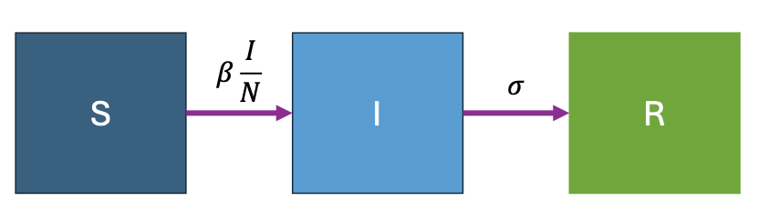
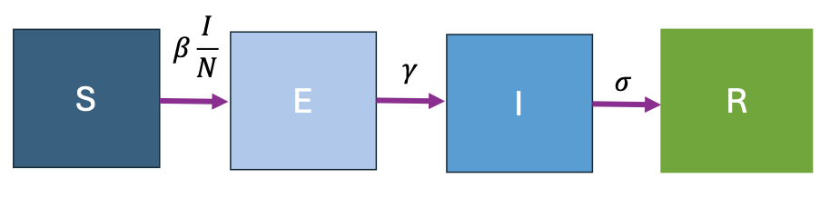

```{r setup, include=FALSE}
knitr::opts_chunk$set(echo = TRUE)
```

The first part of this tutorial is based on the paper by Ginsztajn et al. and the original can be found [here](https://onlinelibrary.wiley.com/doi/full/10.1002/sim.9164). This work is licensed under a [Creative Commons Attribution-NonCommercial-NoDerivatives 4.0 International License](https://creativecommons.org/licenses/by-nc-nd/4.0/).

In this tutorial, we demonstrate how to formulate, fit, and diagnose compartmental model in Stan using the R interface. We consider two different types of routinely collected data to fit our models to: prevalence data (number / proportion of infected people in a population) and incidence data (newly infected people in a population).

In this example, we examine an outbreak of influenza A (H1N1) in 1978 at a British boarding school. The data consists of the daily number of students in bed (prevalence data), spanning over a time interval of 14 days. There were 763 male students who were mostly full boarders and 512 of them became ill. The outbreak lasted from the 22nd of January to the 4th of February. It is reported that one infected boy started the epidemic, which spread rapidly in the relatively closed community of the boarding school. The data are freely available in the R package outbreaks, maintained as part of the [R Epidemics Consortium](http://www.repidemicsconsortium.org/), and is a great resource for trying to fit different models yourself after the course. Since there was no publicly available incidence data associated with this outbreak, we provide some simulated data created to mimic the behaviour of the outbreak.

You may need to run the following code block to install the packages necessary for this practical.  You will either need to copy the code into your console or change ```eval = TRUE``` the first time you run this block.
```{r install packages, eval = FALSE}
install.packages(c("outbreaks", "tidyverse"))
```

Now we can load the necessary packages.
```{r load packages, message = FALSE}
library(outbreaks)
library(tidyverse)
```

To start, we can take a look at what the data looks like.  This command loads the first 5 lines of the data
```{r load data}
head(influenza_england_1978_school)
```
and here is a plot of the full timeseries.
```{r plot data}
theme_set(theme_bw())
ggplot(data = influenza_england_1978_school) + 
  geom_point(mapping = aes(x = date, y = in_bed)) + 
  labs(y = "Number of students in bed")
```

# Fitting an SIR (transmission) model to prevalence data
The simplest model we can consider is the Susceptible-Infected-Recovered (SIR) model. This splits the population in three time-dependent compartments: the susceptible ($S$), the infected (and infectious) ($I$), and the recovered (and not infectious) compartments ($R$). When a susceptible individual comes into contact with an infectious individual, the former can become infected for some time, and then recover and become immune.  

```{r, echo=FALSE, fig.cap="Figure 1: Diagram of SIR model"}

```

From Figure 1, the rate of progression between the S and I compartments is $\beta * I / N$ where $\beta$ is the contact rate, $I$ is the number of infected people and $N$ is the total population. The rate of progression between the $I$ and $R$ compartments is $\sigma$ the recovery rate or 1 divided by the duration of infection.


Q1) Define the equations for an SIR model.


Q2) What are the assumptions of this model?


## Defining the statistical model
We now define the statistical inference model that we will use to fit our transmission model to data. Here we introduce the likelihood or sampling distribution for our model
$$
p(y|\theta),
$$
which tells us, given model parameters $\theta$, how to generate data $y$. In a Bayesian framework, the set of plausible values is characterised by the posterior distribution,
$$
p(\theta | y).
$$

Bayes’ rule teaches us that
$$
p(\theta | y) \sim p(y | \theta) p(\theta)
$$ 
where $p(\theta | y)$ is our posterior distribution and this is proportional to $p(y|\theta)$ our likelihood multiplied by $p(θ)$ our prior distribution. The prior encodes information or our belief about the parameters we have before observing the data. 

### The likelihood
This is the part of the model that we used to link the model estimates of the number of infected students, $I_{ODE}(t)$, for given parameters ($\beta$ and $\sigma$) to the observed data, i.e the number of students in bed, $I_{obs}(t)$. We choose to model the number of students in bed with a count distribution – the Negative Binomial. This distribution allows us to use $I_{ODE}(t)$ as the expected value and account for over-dispersion, through the parameter $\phi$:
$$
I_{obs}(t)∼NegBin(I_{ODE}(t), \phi)
$$
Therefore our likelihood is $p(y∣\theta)$, with $\theta = (\beta, \sigma, \phi)$ as the parameters of the model.

### Priors
We need to specify a prior for each of our three parameter $\theta = (\beta, \sigma, \phi)$. One advantage of the Bayesian approach is that we can formally incorporate prior knowledge about the parameters into the model. We can change this prior if more information becomes available, constraining our parameter estimation more tightly or, on the contrary, increasing its variance. Choosing priors is one of the tricky parts of Bayesian modelling but comes with practice.

### Predictions and derived quantities
Once we fit the model and obtain a posterior distribution for $\theta$, we can derive additional quantities of interests. The posterior distribution of predictions:
$$
p(y_{pred}∣y)=\int p(y_{pred}|\theta) p(\theta | y)d\theta.
$$

## Coding the model in Stan

We will need the following libraries that you should have already installed and options to fit the compartmental model in Stan efficiently.
```{r libraries for stan, message = FALSE}
library(rstan)
library(gridExtra)
rstan_options(auto_write = TRUE) # saves stan model to hardisk
options(mc.cores = parallel::detectCores()) # tells R how many cores you have available for computation.
```

### Coding the ODE
An ODE takes the form
$$
\frac{dz}{dt}=f(t,z)
$$
where $z$ are the states of the compartmental model ($z=(S,I,R)$ for our first example) and $t$ is time. We also need to provide initial conditions $z_0$ at $t_0$ and the times, $τ$, at which we evaluate the solution.

To specify an ODE in Stan, we first code $f$ in the functions block. This function must observe a strict signature:

```{r functions, eval = FALSE}
real[] f(real time, real[] state, real[] theta,
         real[] x_r, int[] x_i)
```
with

* time, $t$;
* state, the volumes in each compartment, $z$;
* theta, variables used to compute $f$, which depend on the model parameters; 
* x_r, real variables used to evaluate $f$, which only depend on fixed data;
* x_i, integer values used to evaluate $f$, which only depend on fixed data.

In our example, the ODEs for the SIR model is defined with the following structure. 

Q3) You need to fill in the equations for the differential equations for S, I and R:

```{r function sir, eval = FALSE}
functions {
  real[] sir(real t, real[] y, real[] theta, 
             real[] x_r, int[] x_i) {

      real S = y[1];
      real I = y[2];
      real R = y[3];
      real N = x_i[1];
      
      real beta = theta[1];
      real sigma = theta[2];
      
      #TODO: fill it in.
      real dS_dt = 
      real dI_dt =  
      real dR_dt =  
      
      return {dS_dt, dI_dt, dR_dt};
  }
}
```
We evaluate the solution numerically by using one of Stan’s numerical integrators.  Here we choose the Runge-Kutta 4th / 5th order and a call to the integrator looks as follows:

```{r integrator, eval = FALSE}
y = integrate_ode_rk45(sir, y0, t0, ts, theta, x_r, x_i);
```
with

* sir, the name of the function that returns the derivatives, f;
* y0, the initial condition;
* t0, the time of the initial condition;
* ts, the times at which we require the solution to be evaluated;
* theta, x_r, x_i, arguments to be passed to f.

We now have all the ingredients to solve our ODE.


### Building the model
We next code the model in Stan, working through the following coding blocks.

The functions block specifies the SIR model.  
```{r stan sir 2, eval = FALSE}
functions {
  real[] sir (...) {...} //copy code from above
}
```

Fixed data is declared in the data block.  This is things like the initial conditions, times and number of days.
```{r data block, eval = FALSE}
data {
  int<lower=1> n_days;
  real y0[3];
  real t0;
  real ts[n_days];
  int N;
  int cases[n_days];
}
```

We code transforms of the data in the transformed data block. In this example, we transform our data to match the signature of sir (with x_r being of length 0 because we have nothing to put in it). We need these as arguments for the numerical integration scheme.
```{r data, eval = FALSE}
transformed data {
  real x_r[0];
  int x_i[1] = {N};
}
```

We next declare the model parameters. If you want some parameter to be bounded, and it is not already guaranteed by it's prior, you need to specify <lower=a, upper=b> when declaring this parameter. Note that this is how you put a truncated prior distribution on a parameter and here we choose to define a prior on the inverse of $\phi$.  
```{r params, eval = FALSE}
parameters {
  real<lower=0> sigma;
  real<lower=0> beta;
  real<lower=0> phi_inv;
}
```

And then transforms of the parameters
```{r transformed parameters, eval = FALSE}
transformed parameters{
  real y[n_days, 3];
  real phi = 1. / phi_inv;
  {
    real theta[2]; // model parameters
    theta[1] = beta;
    theta[2] = sigma;

    y = integrate_ode_rk45(sir, y0, t0, ts, theta, x_r, x_i);
  }
}
```

Our model consists of the prior and likelihood as described above. Here we assume some priors for our parameters and define our likelihood.
```{r model, eval = FALSE}
model {
  //priors
  beta ~ normal(2, 1); //truncated at 0
  sigma ~ normal(0.4, 0.25); //truncated at 0
  phi_inv ~ exponential(5);
  
  //likelihood
  //col(matrix x, int n) - The n-th column of matrix x. Here the number of infected people
  cases ~ neg_binomial_2(col(to_matrix(y), 2), phi);
}
```

Untangled from the inference, we predict the number of cases and recovery time in the generated quantities block:

```{r generated quantities, eval = FALSE}
generated quantities {
  real recovery_time = 1 / sigma;
  real pred_cases[n_days];
  pred_cases = neg_binomial_2_rng(col(to_matrix(y), 2) + 1e-5, phi);
}
```

## Fitting the model in R

Here we write the code to fit the model in R.  You need to copy all the model parts (functions, data, transformed data, parameters, transformed parameters, model and generated quantities from section 1b) into a file called ```sir_model.stan``` in a directory called ```stan_models```.

```{r fit}
# time series of cases
cases <- influenza_england_1978_school$in_bed  # Number of students in bed

# total count
N <- 763;

# times
n_days <- length(cases) 
t <- seq(1, n_days, by = 1)
t0 = 0 

#initial conditions
i0 <- 1
s0 <- N - i0
r0 <- 0
y0 = c(S = s0, I = i0, R = r0)

# data for Stan
data_sir <- list(n_days = n_days, y0 = y0, t0 = t0, ts = t, N = N, cases = cases)

# number of MCMC steps
niter <- 2000
```

Next we compile the model that you will have created, saved in the file ```stan_models/sir_prevalence.stan```,
```{r compile}
model <- stan_model("stan_models/sir_prevalence.stan")
```
and run MCMC. For this problem, it suffices to use Stan’s defaults. Note that, as is standard practice, we run 4 Markov chains.
```{r actual fit}
fit_sir_negbin <- sampling(model,
                data = data_sir,
                iter = niter,
                chains = 4, 
                seed = 0)
```

## Checking the model

### Inference
A good place to start is with a summary table of the results, which displays the posterior mean, standard error, quantiles, and some useful diagnostics.
```{r summary}
pars=c('beta', 'sigma', "recovery_time")
print(fit_sir_negbin, pars = pars)
```

Stan gives us lots of information to evaluate whether the inference is reliable:

* During sampling, warnings can tell us if something is wrong (here we have no warnings but you should check yours). 
* In the summary table, several quantities are available to check inference. 
  - Here we note that $\hat R$ is close to 1 (< 1.01), indicating the 4 Markov chains are in close agreement with one another. 
  - The effective samples size, n_eff, is large (> 1007), which means the Markov chains were able to cohesively explore the parameter space. 
  - Conversely, large $\hat{R}$ and low n_eff would indicate that the Markov chains are poorly mixing. Apart from fixing coding errors, improving the mixing of the Markov chains almost always requires tweaking the model specification, for example with a reparameterisation or stronger priors.

We can furthermore plot the marginal posterior densities and confirm the Markov chains are in agreement with one another.
```{r den plot}
stan_dens(fit_sir_negbin, pars = pars, separate_chains = TRUE)
```

### Model
Now that we trust our inference, we can check the utility of our model. Utility is problem specific and can include the precise estimation of a quantity or predicting future behaviors. In general, it is good to check if our model, once fitted, produces simulations that are consistent with the observed data. This is the idea behind posterior predictive checks.

We sample predictions, $y_{pred}$, from $p(y_{pred}∣y)$ and use these samples to construct a fitted curve for students in bed, together with the uncertainty (90% interval, meaning observed data is expected to fall outside of this interval one in ten times). This posterior predictive check allows us to verify if the model captures the structure of the data. Here we see that the model gives a satisfying fit to the data, and that the model uncertainty is able to capture the variation of the data.
```{r post_pred checks}
smr_pred <- cbind(as.data.frame(summary(
  fit_sir_negbin, pars = "pred_cases", probs = c(0.05, 0.5, 0.95))$summary), t, cases)
colnames(smr_pred) <- make.names(colnames(smr_pred)) # to remove % in the col names
c_posterior = "lightgoldenrod"
ggplot(smr_pred, mapping = aes(x = t)) +
  geom_ribbon(aes(ymin = X5., ymax = X95.), fill = c_posterior, alpha = 0.35) +
  geom_line(mapping = aes(x = t, y = X50.), color = c_posterior) + 
  geom_point(mapping = aes(y = cases)) +
  labs(x = "Day", y = "Number of students in bed")
```

Maybe we also want to access the true number of infected people in the $I$ compartment at each time, and not just the number of students in bed. This is a latent variable for which we have an estimation in our model.
```{r true infections}
params <- lapply(t, function(i){sprintf("y[%s,2]", i)}) #number of infected for each day
smr_y <- as.data.frame(summary(fit_sir_negbin, 
                               pars = params, probs = c(0.05, 0.5, 0.95))$summary)
colnames(smr_y) <- make.names(colnames(smr_y)) # to remove % in the col names
ggplot(smr_y, mapping = aes(x = t)) +
  geom_ribbon(aes(ymin = X5., ymax = X95.), fill = c_posterior, alpha = 0.35) +
  geom_line(mapping = aes(x = t, y = X50.), color = c_posterior) + 
  labs(x = "Day", y = "Number of infected students")
```

# Fitting an SEIR model to prevelance data

A person who is infected with flu is not immediately infectious so it makes sense to include an "Exposed" compartment in our model. This should improve the fit to our model (although we don't evaluate that here in this practical).

```{r, echo=FALSE, fig.cap="Figure 2: Diagram of SEIR model"}

```

The notation in Figure 2 is similar to the SIR model but we have a new parameter $\gamma$ which is the rate of progression from the exposed to infected compartment.  It is equal to 1 divided by the incubation period.

Q4) What are the equations for an SEIR model?

Q5) Edit the stan model file to turn the SIR model in an SEIR model. Save this in the ```stan_model``` directory under a new file called ```seir_prevalence.stan```.  Since we have a new parameter in our model $\sigma$ we need to define a prior for this.  From the literature the incubation period for flu is around 2 days so a prior for sigma of $N(0.5, 0.25)$ would be suitable.  

Hint:  You will need to change the following parts of the model. 

- The functions block to encode the new ODE model, 
- The data block so that y[0] has dimensions of 4,
- The parameter block so the sigma parameter is added, 
- The transformed parameter block so theta[3] is now sigma, 
- The model block needs the prior for sigma adding and,
- The generated quantity block can be used to calculate the incubation period (1/sigma).

Similar to before, the SEIR model can be run as follows. Note we also need to add an initial condition for our exposed compartment.  
```{r seir}

cases <- influenza_england_1978_school$in_bed 

# total count
N <- 763;

# times
n_days <- length(cases)
t <- seq(1, n_days, by = 1)
t0 = 0 

#initial conditions
i0 <- 1
s0 <- N - i0
e0 <- 0
r0 <- 0
y0 = c(S = s0, E = e0, I = i0, R = r0)

# data for Stan
data_seir <- list(n_days = n_days, y0 = y0, t0 = t0, ts = t, N = N, cases = cases)

# number of MCMC steps
niter <- 7500

model <- stan_model("stan_models/seir_prevalence.stan")

fit_seir_negbin <- sampling(model,
                data = data_seir,
                iter = niter,
                chains = 4, 
                seed = 0)
```

Again we can print a summary for our results:
```{r flu seir summary}
pars=c('beta', 'gamma', 'sigma', 'recovery_time', 'incubation_period', 'phi_inv')
print(fit_seir_negbin, pars = pars)

```

and produce plots for our sample predictions of the number of students in bed.
```{r flu seir plots}
smr_pred <- cbind(as.data.frame(summary(
  fit_seir_negbin, pars = "pred_cases", probs = c(0.05, 0.5, 0.95))$summary), t, cases)
colnames(smr_pred) <- make.names(colnames(smr_pred)) # to remove % in the col names
c_posterior = "lightgoldenrod"
print(ggplot(smr_pred, mapping = aes(x = t)) +
  geom_ribbon(aes(ymin = X5., ymax = X95.), fill = c_posterior, alpha = 0.35) +
  geom_line(mapping = aes(x = t, y = X50.), color = c_posterior) + 
  geom_point(mapping = aes(y = cases)) +
  labs(x = "Day", y = "Number of students in bed"))
```


# Fitting an SEIR model to incidence data

The number of infected people in a population is not the only type of data collected during an outbreak. Often we get a line list or a list of the times at which people were infected (or showed symptoms). We have simulated some incidence data for a flu like outbreak with similar parameters to the school data and this can be found in the file ```incidence_seir.rds```. (Do speak to one of us if you are interested in how we did this!).

```{r incidence}
incidence = readRDS("data/incidence_seir.RDS")
```

We now need to change our model to fit the incidence from our model to the data rather than the prevalence. First we need to calculate the incidence, which is equal to the number of people leaving the exposed component or $\gamma E$.  

Q6) Make a new copy of our SEIR model by re-saving ```seir_prevalence.stan``` as ```seir_incidence.stan```. The incidence can be calculated by changing the transformed parameters block to be as follows (note only the for loop around the incidence should have changed).

```{r incidence transformed, eval=FALSE}
transformed parameters{
  real y[n_days, 3];
  real phi = 1. / phi_inv;
  real theta[2]; // model parameters
  real incidence[n_days];

  theta[1] = beta;
  theta[2] = sigma;

  y = integrate_ode_rk45(sir, y0, t0, ts, theta, x_r, x_i);
  for (i in 1:n_days)
    incidence[i] = gamma * y[i, 2];
}

```

Then we need to update the likelihood in the model block to the following since we are now saying that our incidence is negatively binomially distributed instead of the total number of cases.
```{r incidence likelihood model, eval = FALSE}
  //likelihood
  cases ~ neg_binomial_2(incidence, phi);
```

We can now use similar code to fit our model and print a summary of our parameters.
```{r fit seir incidence}
# total count
N <- 763

# times
n_days <- length(incidence)
t <- seq(1, n_days, by = 1)
t0 = 0

#initial conditions
i0 <- 1
s0 <- N - i0
e0 <- 0
r0 <- 0
y0 = c(S = s0, E = e0, I = i0, R = r0)

# data for Stan
data_sir <- list(n_days = n_days, y0 = y0, t0 = t0,
                 ts = t, N = N, cases = incidence)

# number of MCMC steps
niter <- 2000

model <- stan_model("stan_models/seir_incidence.stan")

fit_sir_negbin <- sampling(model,
                           data = data_sir,
                           iter = niter,
                           chains = 4,
                           seed = 0)

pars=c('beta', 'gamma', 'sigma', "recovery_time")
print(fit_sir_negbin, pars = pars)

```
Q7) Note that if you have left the same priors as before, there will be some warnings about your model. Investigate changing the priors and number of iterations to see if you can get rid of the warnings.

We can see how well our model fits the incidence data.
```{r plot inc seir}
params_inc <- lapply(t, function(i){sprintf("incidence[%s]", i)})
smr_inc <- as.data.frame(summary(fit_sir_negbin,
                               pars = params_inc, probs = c(0.05, 0.5, 0.95))$summary)
colnames(smr_inc) <- make.names(colnames(smr_inc)) # to remove % in the col names
c_posterior = "lightgoldenrod"
print(ggplot(smr_inc, mapping = aes(x = t)) +
  geom_ribbon(aes(ymin = X5., ymax = X95.), fill = c_posterior, alpha = 0.35) +
  geom_line(mapping = aes(x = t, y = X50.), color = c_posterior) +
  geom_point(mapping = aes(y = incidence)) +
  labs(x = "Day", y = "Daily incidence") + theme_bw())
```

If we also load in the simulated prevalence data we can see that, as expected, our model estimates the number of infected individuals well.
```{r fit inc prev}
infected <- readRDS("data/infected_seir.RDS")
params <- lapply(t, function(i){sprintf("y[%s,3]", i)}) #total number infected
smr_y <- as.data.frame(summary(fit_sir_negbin,
                               pars = params, probs = c(0.05, 0.5, 0.95))$summary)
colnames(smr_y) <- make.names(colnames(smr_y)) # to remove % in the col names
print(ggplot(smr_y, mapping = aes(x = t)) +
  geom_ribbon(aes(ymin = X5., ymax = X95.), fill = c_posterior, alpha = 0.35) +
  geom_line(mapping = aes(x = t, y = X50.), color = c_posterior) +
  geom_point(mapping = aes(y = infected)) +
  labs(x = "Day", y = "Number of infected") + theme_bw())
```
